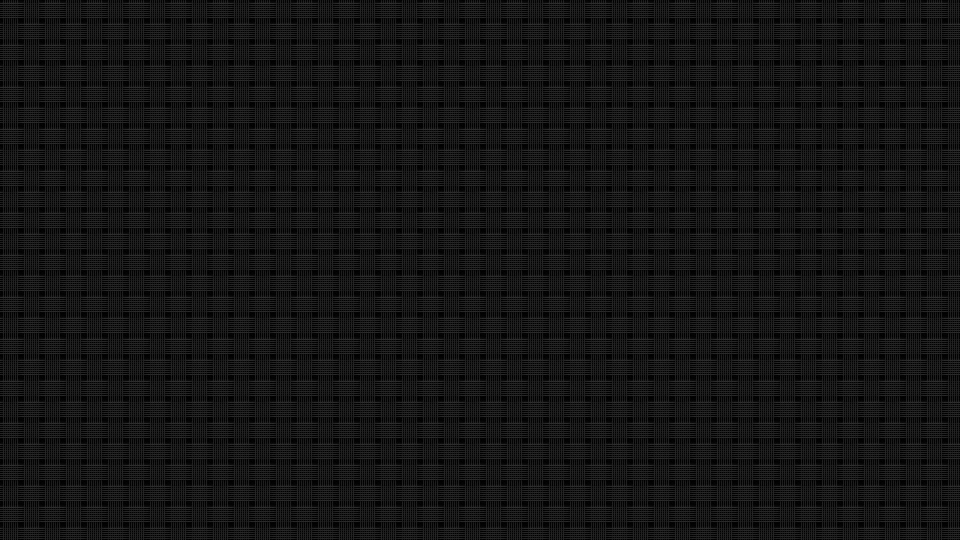

Python program that repeats a given image over some given image size

### Usage ###

the program will ask for the following:
- `width`: width of the new image
- `height`: height of the new image
- `source file`: source pattern image
- `output file`: name of the file created *(must include extension)*

### Requirements ###

- Python 3.x
- OpenCV for Python

### Example ###

**Input:** 
 

**Output:**
 